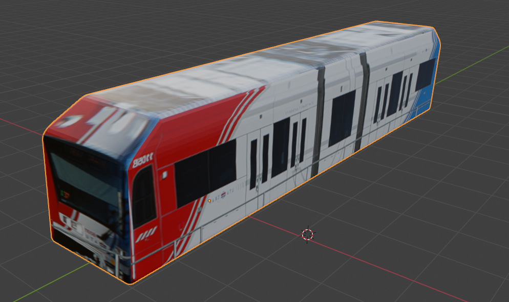
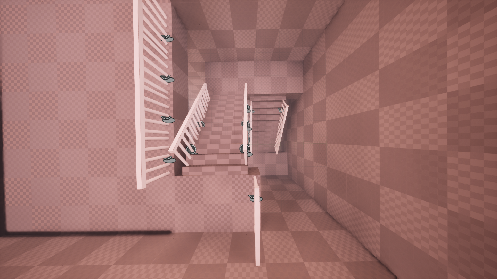
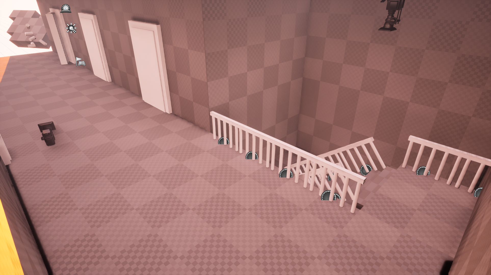
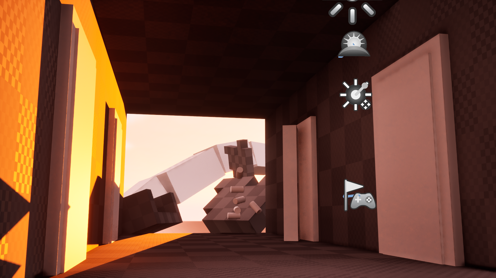
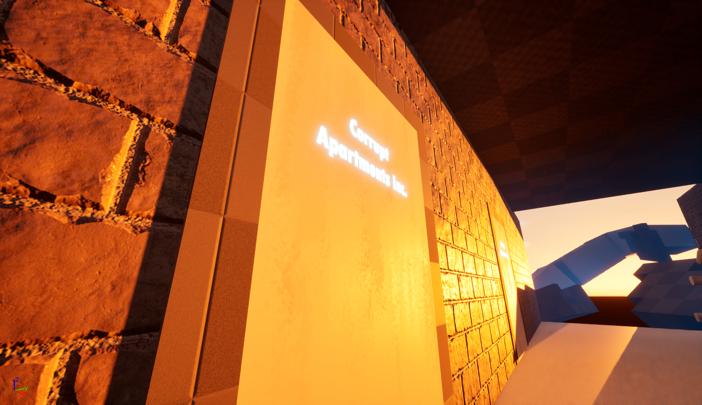
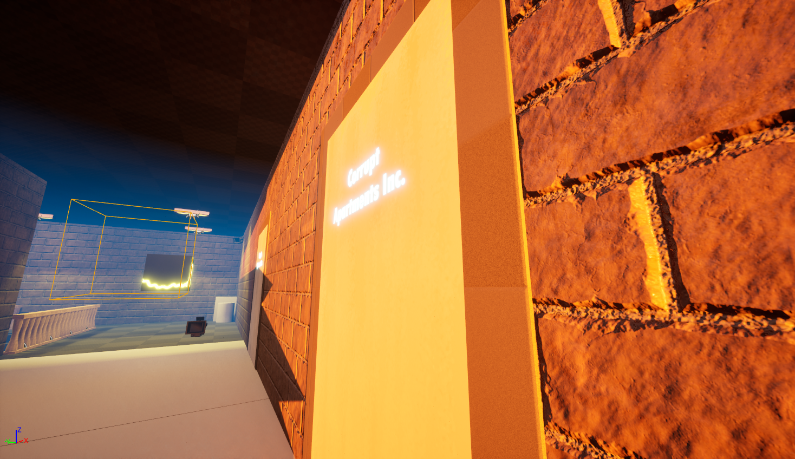
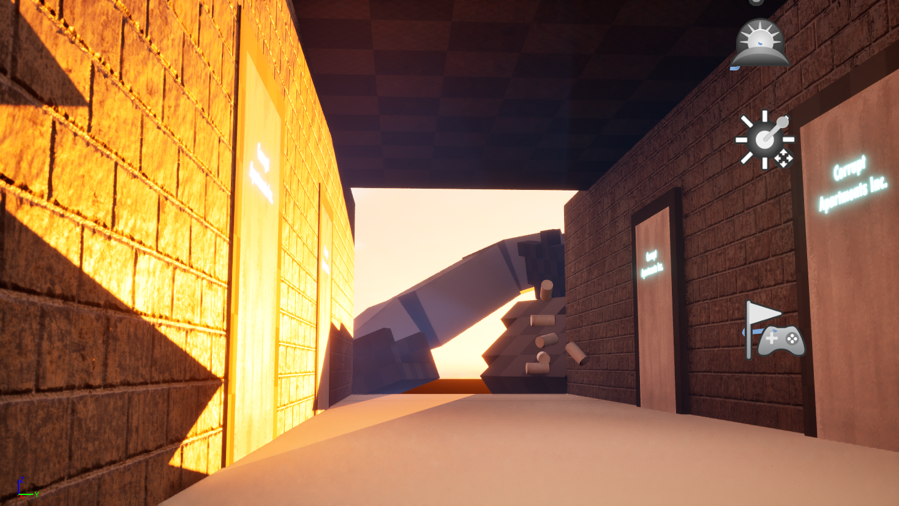
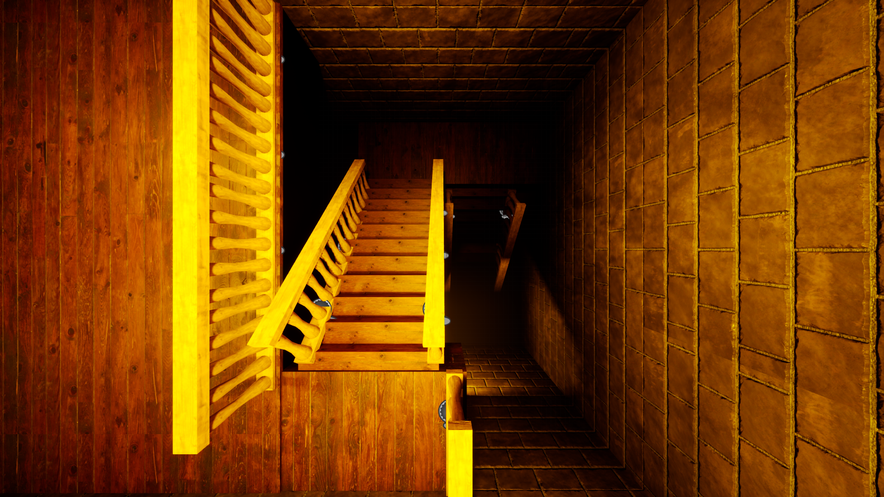
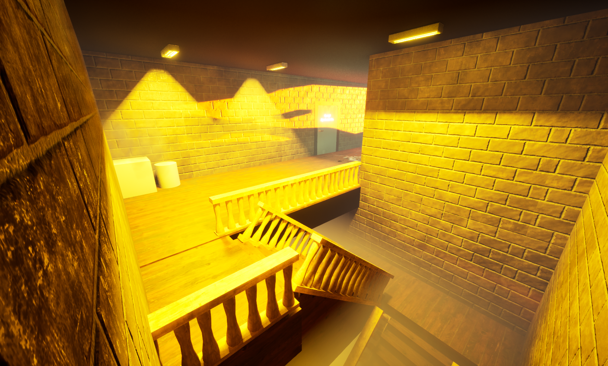

One of the major courses in the program i am attending is asset pipeline. You can think of it as an all-round art course that teaches you not only asset creation but also implementation (specifically in unreal engine). For my section in particular, we learned the ins and outs of the engine by making a single scene from scratch the entire semester. Everything from blocking out a scene, to modeling and texturing individual assets, and rendering things out.

Above you can see one of my final renders, and perhaps the one I'm most fond of personally. i used the built in Path Tracer as opposed to standard forward rendering, and it really brought out a lot of the minor details like the subtle reflective glow of the signs on the door or the sheer magnitude of the bright sun.

At the end of the semester we were required to submit a collection of shots captured in the scene. While the expectation was to just submit renders or screenshots, due to some confusion on my end i ended up submitting a full cinematic render. We were not taught this during the course, but i picked it up rather quickly over a weekend, and i feel that the final render came out quite nicely.

<video controls src="standard render.mp4" title="Title"></video>
Along with this lumen lit render, I used standard path tracing in engine to render the same sequence in movie render queue. unfortunately, one of the depth fog shaders didn't render properly in this mode so i didn't feel comfortable enough to use it as my final submission. that said, i feel its at least worth showing off in some capacity.

<video controls src="pathtraced.mp4" title="Title"></video>

There are also quite a few scene elements id like to highlight in particular here. One of our lessons revolved around making basic particle systems, and i combined that with some external knowledge on how to use flipbooks in unreal. the result was a smoke effect i used in a surreal floating bottle portion of the scene as well as on an ashtray visible in the final sequence.
<video controls src="20241107-2153-10.1013025.mp4" title="Title"></video>

On the topic of these models, pretty much everything was hand modeled by me. While we were given explicit permission to use third party models and textures (think quixel or UE marketplace), i opted for modeling everything by hand and using external textures. It gave me more creative freedom, hence why the bottles are mtn dew. These were made by tracing an off the shelf bottle in blender using an extruded vertex. after that, a screw modifier and some minor UV editing and projection got a bottle that i was extremely proud of and used as a placeholder asset in some other projects.

Speaking of which, that train in the background was modeled under a similar philosophy. Its a UTA Redline train, the one me and a lot of my classmates take to and from school daily. i had to source various images of the trains, which were then projected onto a rough model of the train (if you've ever seen Ian Hubert, this is heavily inspired by his technique). 

on its own, the final car model doesn't look extremely impressive, but thanks to the magic of scene context and lumen, it looks far more passable in the final scene.

the rest of the geometry was modeled in a rather abstract way without much reference. i had a handful of broken wall chunks that were modeled as an elongated square with these big burly Boolean cuts in them, the stair railings were modeled similarly to the bottles, except with added steps of arraying and adding a top and bottom bar, and things like the stairs were mostly default UE5 BSPs. Below you'll find an assortment of progress pics i took as the scene was developing

